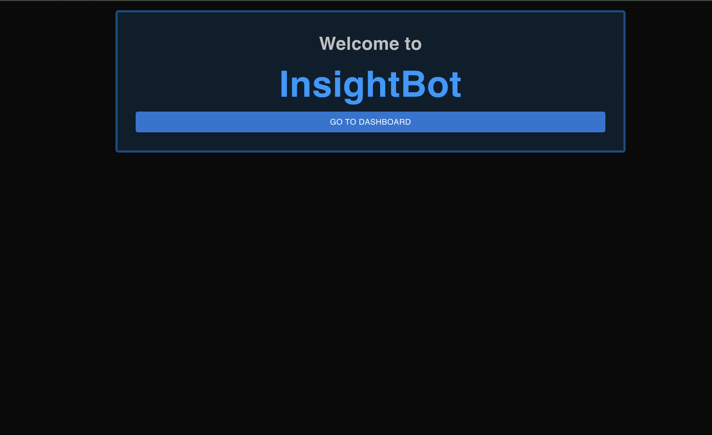
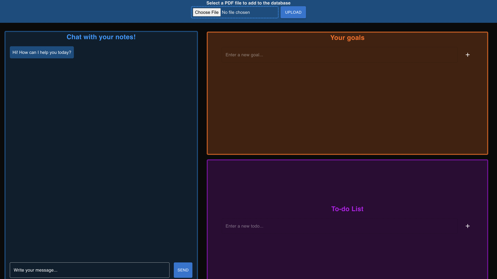

# Insightbot

## Project Description
An intelligent study tool powered by Retrieval-Augmented Generation (RAG) that delivers a personalized learning experience, helping users achieve their goals. Offering on-demand, personalized learning assistance 24/7, it empowers users to stay organized, achieve their goals, and receive tailored support to overcome learning challenges, ensuring continuous progress at any time.

 
 

## Key Features
This AI personal web app combines:
- To-do list
- Goal Tracker
- AI-powered RAG chatbot

## Technologies Used
- Python
- NextJS
- PINECONE
- TYPESCRIPT
- OPEN AI API

## Usage
After navigating to the main page, users can create To-Do List. Click on the ‘+’ button to create a new task. They can set the task’s name. On the main page, users can create their personal or academic goals in the Goal List section. 

Moreover, they can go to the AI Chatbot section to ask questions and get personalized assistance. They can upload files (PDFs, notes, etc.) by clicking the upload button. These files will be analyzed to help the chatbot provide relevant answers. After uploading the files, users can ask the chatbot any question related to your study materials or tasks. It will retrieve information from the files and provide tailored responses. They can also use the chatbot for on-demand assistance, whether they are stuck on a concept or need help in the materials outside of the database.

## Future Directions
We plan to enhance Insightbot by supporting more diverse types of data uploads, including videos and links, allowing users to interact with a broader range of content. We’re also exploring how to refine the chatbot’s natural language processing capabilities to handle more complex queries and improve user experience.
